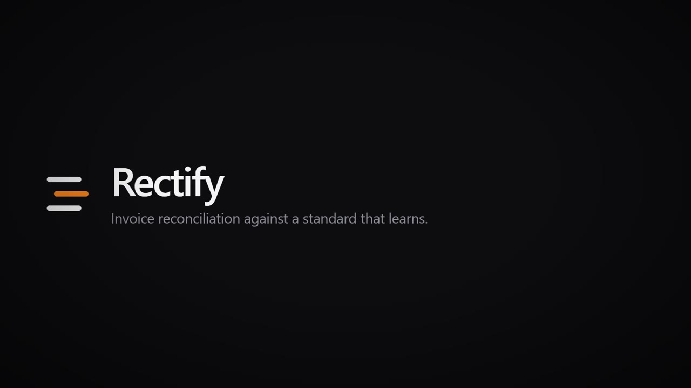

# Rectify

Invoice reconciliation against a standard that learns.

Live: [rectify.cloudflare-hackathon.workers.dev](https://rectify.cloudflare-hackathon.workers.dev/).

My team's project for **Cloudflare Singapore Developers Day**, 27 August 2026.

## The trailer

Thirty seconds, for pitching. Click through to play:

[](https://github.com/Cyvid7-Darus10/cloudflare-dev-event-hackathon/raw/main/public/trailer.mp4)

It also streams from the deployed Worker, which is the link to use in a room with
patchy wifi and a browser already open:
[rectify.cloudflare-hackathon.workers.dev/trailer.mp4](https://rectify.cloudflare-hackathon.workers.dev/trailer.mp4).

Every figure on screen is real, taken from [`fixtures/session-a.json`](fixtures/session-a.json):
invoice NW-INV-24817 at S$4,325.34, corrected to S$4,255.58, overstated by S$69.76
across four lines. Built with [Remotion](https://remotion.dev); 1920x1080, 30fps.

## The idea

A supplier sends an invoice as a PDF. Somebody opens it next to a price list and
checks it line by line — is that the right SKU, is that the contracted price, is
that the right unit of measure. It is slow, it is error-prone, and the knowledge
gained ("this vendor calls SKU-4471 a *Widget Pro 2K*") evaporates the moment the
check is done.

Upload an invoice. It is parsed to structured JSON, every line is matched against
a canonical product standard, and every field difference is flagged. A reviewer
accepts, rejects, or edits each flag in a live UI. Accepting a correction
**writes back into the standard** — the corrected price, and the vendor's odd
product name recorded as an alias. Then a clean, corrected invoice is published
as a PDF.

The payoff: the standard gets smarter with every document. Invoice #1 needs
manual decisions. Invoice #2 from the same vendor auto-matches, because the
system learned.

The model reads and compares. It does not decide. Only a human resolution
changes the standard.

## Run it locally

You need Node 22+ ([`mise.toml`](mise.toml) pins it — Wrangler 4 refuses to
run on anything older) and npm.

```bash
npm install
npm run migrate:local
npx wrangler dev -c wrangler.local.jsonc
```

[`wrangler.local.jsonc`](wrangler.local.jsonc) runs everything in Miniflare
with no Cloudflare login. That covers the whole session flow — upload, review,
publish. Real document extraction uses Workers AI, Browser Rendering, and
Vectorize, which have no local simulator; for those, `wrangler login` first and
then `npm run dev` (which uses `wrangler.jsonc`).

No backend at all? Open the UI with `?demo=1` and every API call is answered
from fixtures. [`public/README.md`](public/README.md) explains how.

## Tests

```bash
npm test                     # unit + integration, in the Workers runtime
node scripts/demo-e2e.mjs    # headless-browser walk of the fixture-backed demo flow
node scripts/real-e2e.mjs    # same walk against the real backend
```

The two e2e scripts expect a dev server on `http://127.0.0.1:8787` (or pass a
base URL) and Playwright, which is not a repo dependency:
`npm i --no-save playwright`.

## Where things are

| | |
|---|---|
| [`architecture.md`](architecture.md) | The design. Services, contract, timeline, drop ladder. **Start here.** |
| [`plan/`](plan/README.md) | The working split — one file per person |
| [`src/shared/contracts.ts`](src/shared/contracts.ts) | The frozen contract every workstream codes against |
| [`fixtures/`](fixtures/) | The canonical fixtures, so nobody waits on anybody |

## Why Cloudflare

Eleven services, each load-bearing — Workers and Workers AI, AI Gateway,
Workflows, Durable Objects, D1, R2, KV, Vectorize, Queues, and Browser
Rendering. `architecture.md` says what each one earns its place doing.

## Deploying your own

[`wrangler.jsonc`](wrangler.jsonc) names our account and resource IDs. To run
your own copy: create your own D1 database, R2 bucket, KV namespace, Vectorize
index, and queues; swap the IDs in `wrangler.jsonc` for yours; then

```bash
npm run deploy
npm run migrate:remote
```

## The team

Bryan, Cyrus, Michelle, Siva, Zuriel. Five people, two hours, five disjoint
directories and one frozen contract.

## Licence

[MIT](LICENSE).
